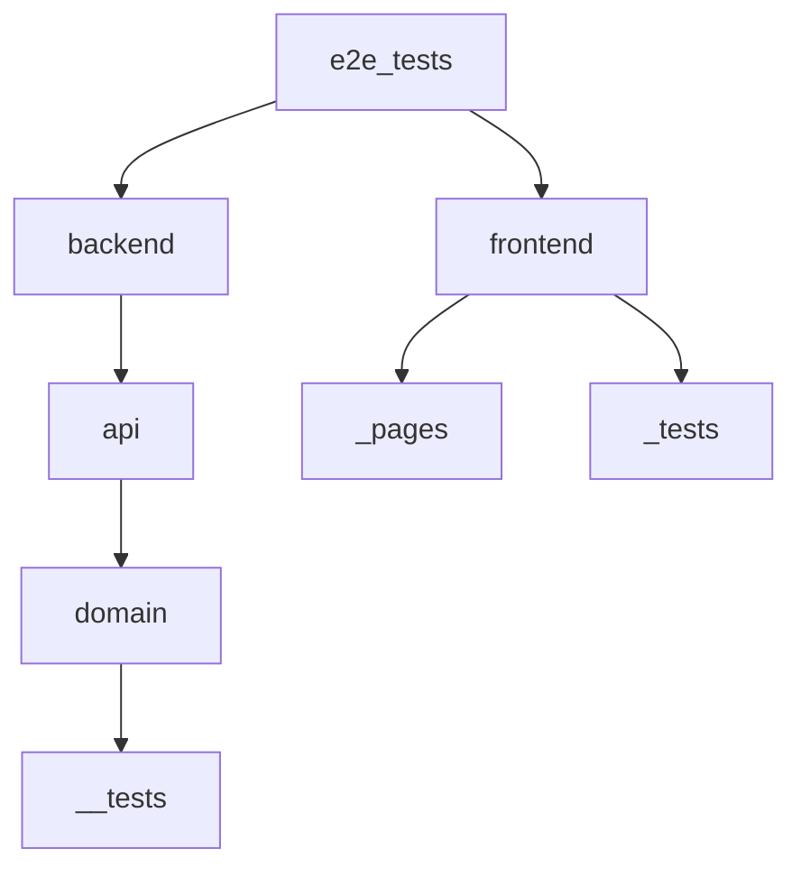

# qa-automation-ts-playwright

## Internal QA Automation Framework
---
## Installation

After pulling this project or later changes please run this command to make everything work as expected:

```typescript
npm install
```

---

## .env file configuration (optional)

Create your own .env file from .env.example file.
.env file should contain following values to run tests:

- USERNAME='Username'
- PASSWORD='Password'

All the values should be changed to real ones. 

---

## Run tests

Before running tests you need to install ```npm``` (8 or abover), ```node``` (16 or above), ```typescript``` and ```ts-node``` globally.

To run frontend tests following command should be used:

```typescript
npm run test:fe
```

To run API tests following command should be used:

```typescript
npm run test:api
```

---

# Structure of repository



---
# For Visual Studio Code users

- Please install Eslint and Prettier ESLint extension to do static code analysis before pushing them to main branch.
- For the file imports adjustments should be made for VSCode to make right file path import:
Go to ```settings``` -> Search for ```importModuleSpecifier``` -> Import Module Specifier values for Javascript and Typescript should be set to ```relative```.
